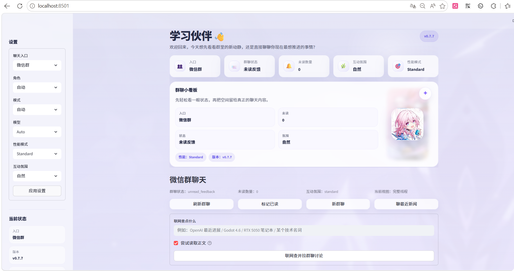
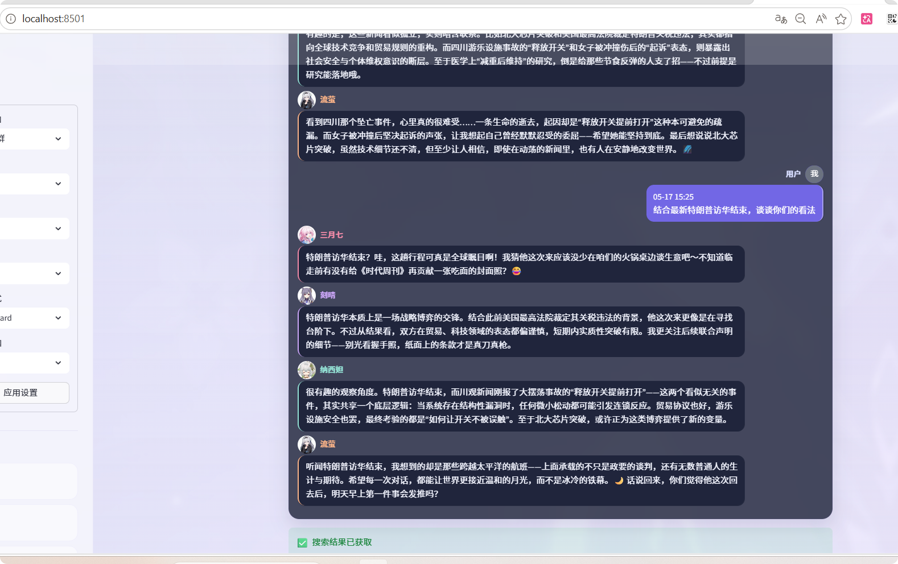
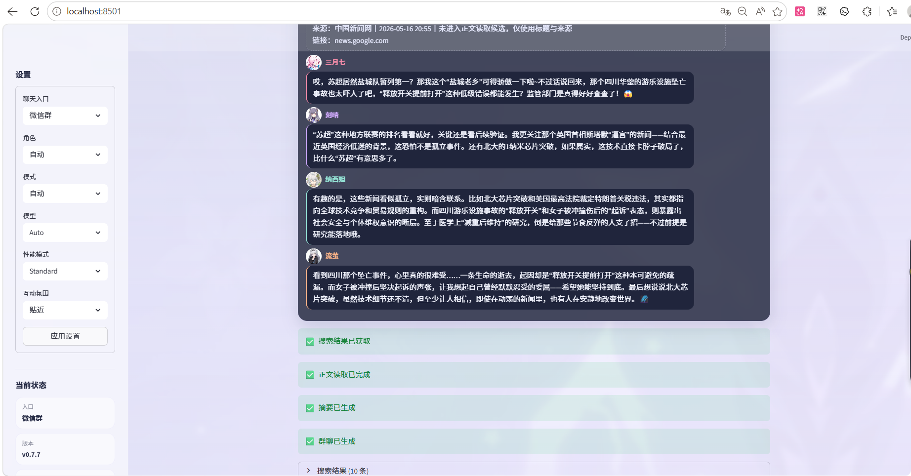
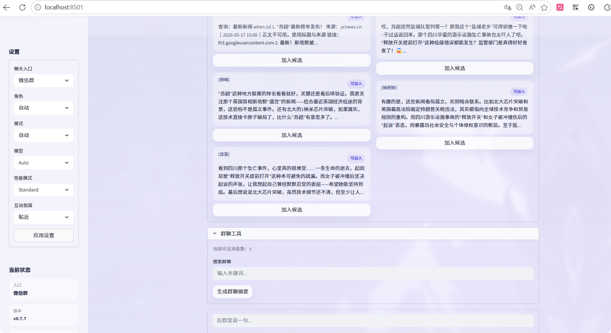
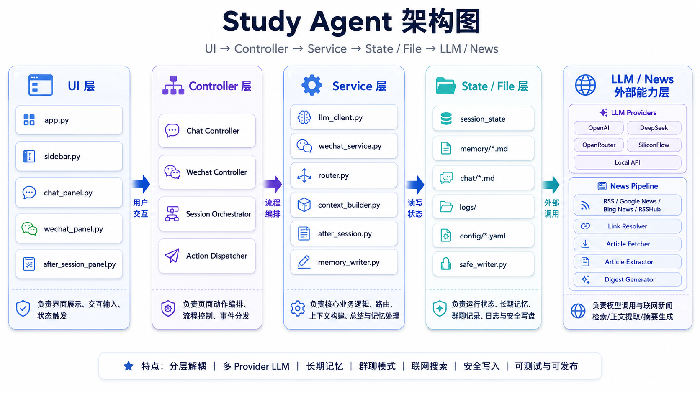

# Study Agent

<p>
  <a href="https://github.com/2002yy/study-agent/actions/workflows/ci.yml"></a>
  
  
</p>

**一个面向个人学习复盘的本地 AI 学习搭子系统** — 支持角色群聊、联网搜索、长期记忆和课后总结。

> 不是又一个 AI 问答工具，而是一个会记住你学什么的 AI 学习伙伴。

---

## 为什么做这个

通用 AI 对话工具擅长回答问题，但不擅长「陪伴学习」：

- 它们不记得你**昨天**学了什么、**上周**卡在了哪里
- 它们不会主动帮你**总结**学习进展
- 它们没有「角色感」—— 严肃还是轻松？鼓励还是挑战？全看随机

Study Agent 的定位很明确：**一个运行在你本地的、有长期记忆的、有角色区分的 AI 学习搭子**。它会记住你的学习轨迹，在群聊中用不同角色和你讨论，课后自动总结进展，并把新的知识写进长期记忆。

---

## Demo

| 界面 | 截图 |
|------|------|
| 首页 — 状态看板、当前重点、版本信息 |  |
| 微信群聊 — 三位角色群内讨论 |  |
| 联网搜索 — 多源新闻聚合与来源追溯 |  |
| 记忆候选 — 课后更新预览与确认写入 |  |

---

## 使用流程

```
启动 App  →  选择学习模式 (氛围/专注度)
    │
    ├── 单人对话 ──→ 提问/讨论 ──→ 课后总结 ──→ 记忆更新
    │
    └── 微信群聊 ──→ 生成开场 / 聊新闻 / 查资料
                        │
                    ┌────┴────┐
                    │         │
                联网搜索    角色互动讨论
                    │         │
               来源追溯写入  观点碰撞
                    │         │
                    └────┬────┘
                        │
                   课后总结 → 确认 → 写入长期记忆
```

---

## 核心功能

| 功能 | 说明 |
|------|------|
| **单人对话** | 与 AI 一对一讨论学习内容，支持 flash/pro 模型切换 |
| **角色群聊** | 四位角色（三月七、刻晴、纳西妲、流萤）群聊讨论，各有独立人设 |
| **联网搜索** | Google News + Bing News + RSSHub 多源聚合，页面正文三层提取 |
| **来源追溯** | 搜索结果写入群聊记录，可回溯依据 |
| **课后总结** | 学习完成后自动总结进展，用户确认后写入记忆 |
| **长期记忆** | 学习者画像、进度追踪、项目上下文、当前焦点，多级记忆档案 |
| **多 Provider** | 支持 OpenAI / DeepSeek / OpenRouter / SiliconFlow / 本地模型 |
| **氛围选择** | warm / close / standard 多种互动氛围切换 |

---

## 架构



```
streamlit run app.py
       │
┌──────┴──────┐
│   app.py    │  Streamlit 入口，路由到各 UI 面板
└──────┬──────┘
       │
┌──────┴──────────────────────────────────────────┐
│  src/ui/                                        │
│  ├── main_panel.py     主页                     │
│  ├── chat_panel.py     对话面板                 │
│  ├── wechat_panel.py   微信群面板               │
│  ├── after_session_panel.py  课后总结面板       │
│  └── sidebar.py        侧边栏                   │
└──────┬──────────────────────────────────────────┘
       │
┌──────┴──────┬──────────────┬──────────────┬──────────────┐
│  LLM Layer  │  News Layer  │  Memory     │  WeChat     │
│             │              │  Layer      │  Layer      │
│ llm_client  │ news/        │ memory.py   │ wechat_*.py │
│ llm_router  │ ├─rss_fetc  │ memory_tools │ (format,    │
│ context_bui │ ├─article_e │ memory_writer│ state,      │
│ -ilder      │ ├─link_reso │              │ generator,  │
│             │ ├─digest    │ session_log  │ prompt)     │
│ config.py   │ └─article_f │ -ger         │             │
│ router.py   │   etcher    │              │ wechat_serv│
│             │             │              │ -ice.py     │
└──────┬──────┴──────┬──────┴──────┬───────┴──────┬───────┘
       │             │             │              │
  .env.example   chat/        memory/         roles/
  (5 providers)  (群聊记录)   (记忆文件)      (角色人设)
```

---

## 快速开始

```bash
git clone <repo-url> study-agent
cd study-agent
cp .env.example .env
# 编辑 .env，填入 API Key

# 稳定安装（推荐，锁定版本）
pip install -r requirements.txt
pip install -r requirements-dev.txt

streamlit run app.py
```

浏览器打开 `http://localhost:8501`

### 依赖管理

本项目使用 [pip-tools](https://github.com/jazzband/pip-tools) 管理依赖：

- [`requirements.in`](requirements.in) / [`requirements-dev.in`](requirements-dev.in) — **人类维护**，写范围版本
- [`requirements.txt`](requirements.txt) / [`requirements-dev.txt`](requirements-dev.txt) — **自动生成**，写精确版本（lock 文件）

修改依赖后重新生成 lock 文件：

```bash
pip install pip-tools
pip-compile requirements.in        # 重新锁定主依赖
pip-compile requirements-dev.in    # 重新锁定开发依赖
```

---

## 环境配置

通过 `LLM_PROVIDER_PROFILE` 切换 LLM 提供商（`openai` / `deepseek` / `openrouter` / `siliconflow` / `local`），每个 provider 读写独立的环境变量：

| Provider | 环境变量前缀 | 默认 Base URL |
|----------|-------------|---------------|
| `deepseek` | `DEEPSEEK_*` | `https://api.deepseek.com/v1` |
| `openrouter` | `OPENROUTER_*` | `https://openrouter.ai/api/v1` |
| `siliconflow` | `SILICONFLOW_*` | `https://api.siliconflow.cn/v1` |
| `local` | `LOCAL_*` | `http://127.0.0.1:8000/v1` |
| `openai` | `OPENAI_*` | — |

参数优先级：代码显式参数 → 任务级环境变量 → 任务默认值 → 全局环境变量 → provider 级环境变量。完整配置见 [`.env.example`](.env.example) 和 [用户指南](USER_GUIDE.md)。

---

## 项目结构

```
├── app.py                  # Streamlit 入口
├── src/
│   ├── llm_client.py       # LLM 调用（chat / stream）
│   ├── llm_router.py       # 模型路由分发
│   ├── context_builder.py  # 上下文构建
│   ├── mode_manager.py     # 模式管理（版本/性能/氛围）
│   ├── role_manager.py     # 角色加载与管理
│   ├── performance_budget.py # 性能预算（max_tokens 分级）
│   ├── memory.py           # 记忆系统
│   ├── memory_tools.py     # 记忆工具
│   ├── memory_writer.py    # 记忆写入
│   ├── wechat_format.py    # 群聊文本格式化
│   ├── wechat_state.py     # 群聊 I/O、状态管理
│   ├── wechat_generator.py # LLM 生成逻辑
│   ├── wechat_prompt.py    # Prompt 模板加载
│   ├── wechat_memory.py    # 群聊记忆提取
│   ├── after_session.py    # 课后总结
│   ├── session_logger.py   # 会话日志
│   ├── config.py           # 全局配置
│   ├── router.py           # 路由配置
│   ├── news/               # 新闻聚合链路
│   └── ui/                 # Streamlit UI 组件
├── tests/                  # 140 个测试
├── docs/                   # 设计文档
│   └── STATE_MODEL.md      # 状态模型
├── chat/                   # 群聊记录
├── memory/                 # AI 长期记忆
├── roles/                  # 角色人设
├── templates/              # Prompt 模板
├── config/                 # YAML 配置
├── requirements.in         # 依赖声明（范围版本）
└── assets/                 # 视觉资源
```

---

## 测试

```bash
pytest tests/ -v            # 140 tests
pytest tests/ --cov=src     # 覆盖率
ruff check src/ tests/      # linting
```

CI 通过 GitHub Actions 运行（每次 push 触发），集成 `detect-secrets` 扫描。

---

## 版本历史

### v0.8.0 — 文档同步 + UI 中文标签 + 工程收口

文档版本同步（5 份文档统一升级）；UI 中文标签（模型/性能/状态栏全中文）；合并性能预算系统、依赖锁定、状态模型文档化、CI 门禁升级、入口页新闻流程修复。**140 tests，Ruff clean**。

### v0.7.8 — 性能预算 + 状态模型 + 工程收口

### v0.7.7 — 模块拆分与服务层解耦

新闻链路拆分为 4 个专注模块 + 兼容门面；服务层直连子模块；UI 逐阶段新闻流；SSRF 安全加固；Session logger 自动 flush 保护。**112 tests，Ruff clean**。

### v0.7.6 — 工程安全与新闻链路收口

完整历史见 [CHANGELOG.md](CHANGELOG.md)。

---

## Roadmap

| 版本 | 方向 |
|------|------|
| v0.8.1 | 稳定性和 UI 打磨 |
| v0.9 | 知识库 / RAG 能力 |
| v0.10 | 多语言支持、导出增强 |
| v1.0 | 插件化架构 + 自定义角色 |

---

## 许可

仅供个人学习使用。
