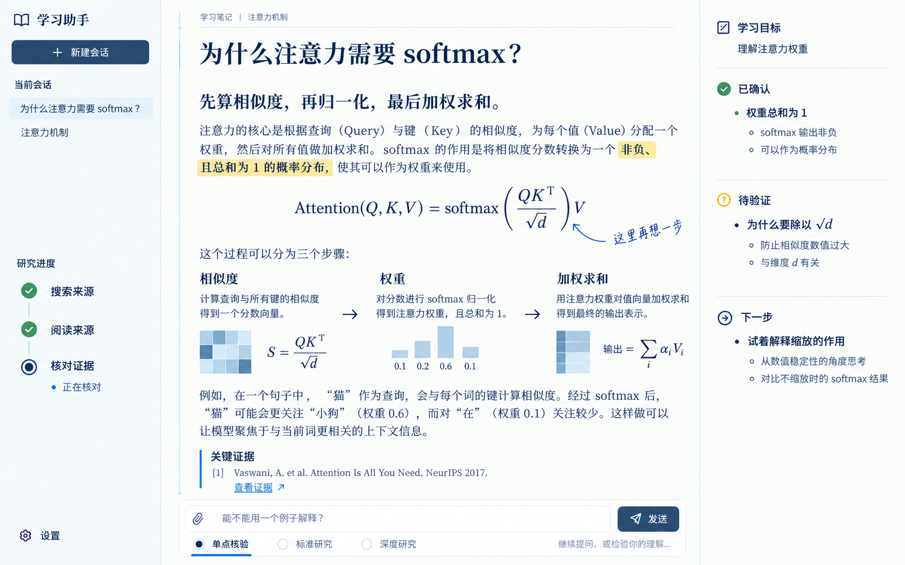
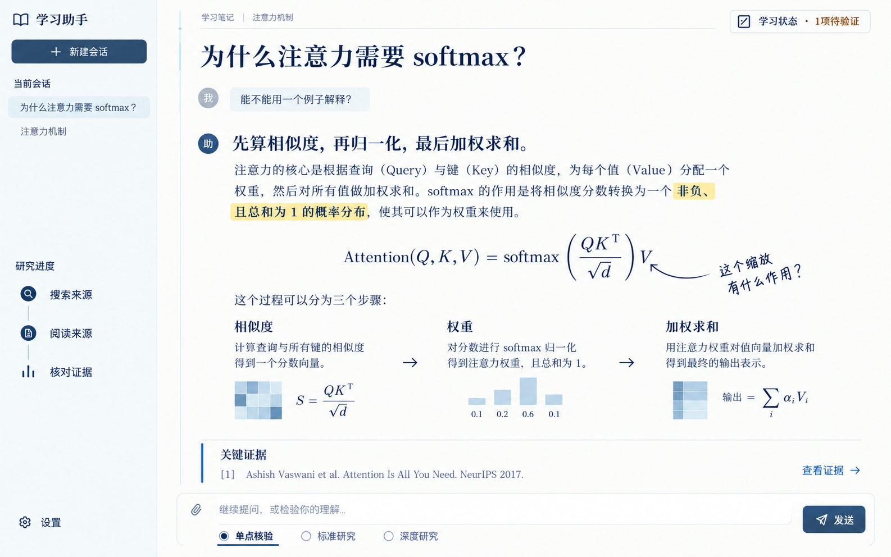
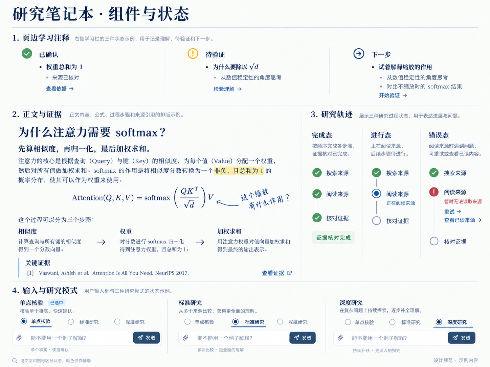

# Study Agent：研究笔记本页面规范 v1

2026-10-05 · 用户已选定A为日常主界面。**产品定位：Study Agent默认界面＝研究笔记本。** B保留为深度研究/推演视图方向，C保留为成果/复盘方向；本规范只覆盖A主工作页及其状态，不实现B/C。

本页是前端实现基线：80%学术阅读器、20%辅助批注。业务数据、发布权限、学习确认和研究预算沿用现有合同。三张内置ImageGen图用来说明版面和状态；精确尺寸、文字、状态语义以下表为准，图片中的示例不能成为真实用户数据。

## 1. 页面与适配

| 项目 | 默认桌面：1600×1000 CSS px | 13寸参考：1280×800 CSS px |
| --- | --- | --- |
| 显示条件 | viewport宽度≥1360 | 1024≤viewport宽度<1360；设备英寸不作为断点 |
| 左栏 | 216px，会话在上、研究轨迹在下，设置靠底 | 192px，保留会话和研究轨迹，不缩成不可辨认图标列 |
| 中栏 | `minmax(0,1fr)`；正文max-width760px，左右内边距48px | 灵活占剩余宽度；正文max-width760px，左右32px |
| 右栏 | 280px，左右24px；学习目标、已确认、待验证、下一步开放排布 | 默认收起；页头按钮“学习状态”，有真实未验证项才加计数 |
| 输入区 | 中栏底部停靠；与正文同宽，内边距12px | 中栏底部停靠，两行布局；模式选择不挤压文本输入 |
| 滚动 | 正文独立滚动；两侧超高时各自滚动 | 正文自然延续，不把全文等比缩进800px高度 |

左栏是会话与过程痕迹，中央是对话/学习正文，右栏是页边学习注释。三栏以1px细线分界，不用三块悬浮大卡包裹。用户消息明确保留在回答上方，不能移入输入框充当已发送内容。来源和“查看证据”保留在正文末尾；正文不会被输入区覆盖，底部留出输入区实际高度＋24px。

窄屏学习注释展开为右侧drawer：宽320px或`calc(100vw - 32px)`中较小者，不挤压正文。打开后焦点进入drawer，关闭返回入口；不丢失当前学习条目/滚动位置。宽度768–1023时左栏也收为会话drawer；<768时正文单栏、横向内边距20px、标题24px，学习状态入口仍可见。长公式/代码只在自身容器内横向滚动，页面不横向溢出。

## 2. 色板、字体与间距

| Token | 值 | 用途 |
| --- | --- | --- |
| paper | `#FBFCFA` | 近白正文纸面，不泛黄 |
| rail | `#F0F4F5` | 低对比侧轨背景 |
| ink | `#203A51` | 正文/标题主墨色 |
| muted | `#526879` | 辅助文字、出处和placeholder |
| primary | `#315B7C` | 主按钮、交互、页边线 |
| rule | `#D8E2E8` | 结构分隔；不独自表达状态 |
| highlight | `#F5E7A0` | 少量荧光笔背景；前景仍为ink |
| confirmed | `#2C6849` | 学习理解已确认的辅助色 |
| pending | `#875D17` | 待验证辅助色，不与服务错误混用 |
| error | `#9D3734` | 读取/执行失败及必要错误文字 |

纸感只允许极弱静态颗粒：正文无纹理默认，若增加颗粒，只放底层、最大alpha0.015；开启后重新测对比，不能盖在字上。不使用旧书黄纸、撕边、螺旋装订、强阴影或漂浮便签。正文和页边注不设圆角外框；按钮6px、输入容器10px，drawer可直角。阴影默认无，仅drawer需要时使用低强度遮罩。

| 文本角色 | 字体栈 | 尺寸 / 行高 / 字重 |
| --- | --- | --- |
| 页标题 | Noto Serif SC / Source Han Serif SC / STSong / serif | 桌面32/44/600；窄屏28/40/600 |
| 正文分节标题 | 同标题字体 | 22/32/600 |
| 主正文 | Noto Sans SC / Microsoft YaHei / system-ui | 桌面18/32/400；窄屏16/28/400 |
| 导航/按钮/输入/状态标签 | 同正文字体，保持排印 | 14/22/500；输入16/26/400 |
| 页边正文/出处 | 同正文字体 | 页边14/24/400；出处13/22/400 |
| 少量手写批注 | KaiTi / STKaiti / serif | 16/26/400；无字体时退回正文，不随机倾斜整段 |
| 数学/源码 | 复用现有数学与代码渲染器 | 公式桌面24–28px、窄屏20–24px；代码14/22 |

spacing基准4px：4/8/12/16/24/32/48/64。段落间16px，分节间32px，来源前24px；右栏各状态之间24px，分隔线与内容各留16px。重要操作最小点击区44×44px；图标18px、笔画1.5px，不使用不同风格图标拼盘。完整字体资产在实现阶段核对许可证及加载策略，不以字体外网加载成功作为页面可用前提。

## 3. 七组组件

| 组件 | 结构与职责 | 视觉及交互约束 |
| --- | --- | --- |
| NotebookPage | 语义article，标题、用户消息、回答、公式、过程图、脚注 | 开放纸面，正文宽度固定上限，长内容可选择/复制；不为每段加框 |
| MarginNote | 对某个真实段落/学习条目的辅助文字；可带anchor | 批注短于两行；箭头只走留白，不跨正文；没有anchor就不画关系线 |
| HighlightSpan | 阅读标注或证据原文中的短span | 使用语义mark；高亮不等于事实已验证；不得自动把模型判断涂成“有证据” |
| EvidenceCallout | 来源标题、实际引用/字段、来源链接、查看证据 | 2px蓝色左线＋16px内距；无完整外框；保留source id/span/digest消费，不改合同 |
| LearningStateRail | 当前目标、已确认、待验证、主要下一步 | 只读现有可信学习状态投影；开放分组和细线，不显示KPI/进度百分比 |
| ResearchTimelineRail | 当前运行的搜索、读取、核对过程 | 左栏20px节点＋细竖线；只呈现实际步骤，不伪造已执行事件/来源数 |
| ComposerBar | 多行输入、附件/已有操作、模式选择、发送/停止 | 两行结构，选择状态有文字＋圆点＋下划线；复用现有输入和运行状态合同 |

允许手写的位置：短批注、圈选、下划线、辅助箭头、一个过程强调点。主正文、按钮、导航、输入框、来源原文和错误信息均排印。每屏最多3处手绘强调、每个段落至多1处荧光笔；图表中的箭头可以说明关系，但不能为不存在的证据建立假关联。

手绘primitive是独立装饰层、`aria-hidden`且`pointer-events:none`，不改变正文流、不遮住链接。尺寸/字体变化后重算位置；关键语义必须仍有可读文字。Rough Notation/Scribble UI仅为后续候选；此规范不安装依赖，也不要求把所有组件换成手绘库。

## 4. 状态化规范

| 学习注释 | 标志/文字 | 动作与语义 |
| --- | --- | --- |
| 已确认 | 绿色勾＋“已确认”＋具体学习命题 | “查看依据”；必须来自既有理解验证状态，读到来源不等于确认掌握 |
| 待验证 | 琥珀色问号＋“待验证”＋具体理解缺口 | “检验理解”；不是异常/bug，不用红色失败语气 |
| 下一步 | 蓝色箭头＋“下一步”＋一个主要行动 | “开始验证”等真实动作；没有可执行动作就只显示文字 |
| 空/未知 | “尚无已确认内容”“学习状态待更新”等 | 不编造计数/进度，不把unknown原始枚举显示出来 |
| 来源已变动 | 文字“依据已变化，待重新验证”＋更新标志 | 不继续沿用已确认视觉，复用现有freshness解释 |

| 研究轨迹 | 节点外观 | 文案与行为 |
| --- | --- | --- |
| 等待 | 空心圈＋步骤名 | “等待阅读”等；无反复闪烁 |
| 进行 | 蓝色实心/双圈＋“正在阅读来源/正在核对证据” | 仅当前步骤轻动效；停止入口在运行中可用 |
| 完成 | 勾＋步骤名 | 默认“本轮研究已结束”；只说明执行完成 |
| 错误 | 红色感叹号＋“暂时无法读取来源” | “重试”“查看已读来源”依真实能力出现；原始error.message只进开发者诊断 |
| 取消/部分完成 | “研究已停止，保留已读取来源”等事实文案 | 不画后续步骤为完成，不把partial写成通过 |

**状态三条独立轴：** 可读来源、逐事实支持、理解验证。只有后端明确证据Gate通过才能显示“证据校验已通过”；流程全部结束、reader成功或official-first命中都不能推导该文字。“来源已核对”也不能把学习命题改成“已确认”。未知枚举安全落为“状态未知/其他状态”，原始值不进入产品UI。

正文高亮只标阅读重点；关键证据必须显示真实原文/已绑定字段，缺少请求字段时写“该字段尚未核实”，不补写。公式使用当前数学渲染器，支持选取/辅助描述；不把公式烘焙成图片。页边批注不伪造引用文本、关系或理解验证。

## 5. 输入区三种模式

| 显示名称 | 用户侧说明 | 选中状态与边界 |
| --- | --- | --- |
| 单点核验 | 单个事实 | 深蓝圆点＋下划线＋名称加重；内部lookup合同不改 |
| 标准研究 | 多源比较 | 同一交互样式；沿用standard合同，不通过换皮扩大证据权限 |
| 深度研究 | 持续补缺 | A壳暂保留模式入口；B专用视图以后独立设计，实现能力不足则明确禁用/说明 |

placeholder：“继续提问，或检验你的理解…”；快捷键显示遵循用户当前设置，使用“回车键”等中文标签。中文输入法组合输入时不触发发送。发送中显示“停止”，禁用态保留原因，不丢草稿。模式切换只影响下一次新请求，不能无提示中断/改变正在运行的研究。键盘radio/方向键行为、选中语义及焦点按真实控件实现；不要只画三枚无行为文字。

## 6. 验证与落地顺序

八组纸面/高亮/侧栏文字色对比比值为5.25–11.43，计算记录见[contrast-check.json](notebook/contrast-check.json)。这是固定token计算，不是截图测量或全站合规证明。普通文本至少4.5:1，状态不能仅靠颜色表达；依据[W3C对比度解释](https://www.w3.org/WAI/WCAG22/Understanding/contrast-minimum.html)及[颜色使用解释](https://www.w3.org/WAI/WCAG22/Understanding/use-of-color.html)。实现后另查真实字体、纹理、hover/focus/disabled色、键盘、200%缩放、窄屏及reduced-motion。

图片已审阅；生成误差明确不进入合同：desktop未在正文保留用户问题、把示例放入输入框；标题及侧栏宽度未严格遵守数值；参考图实测desktop/compact均1586×992、states为1448×1086；compact生成输出仍为同尺寸图片，未证明1280CSS视口；state板把“来源已核对”放在已确认项下，不能据此产生学习确认。实现须按本页规则修正，在真实1600×1000与1280×800浏览器截图验证；不能称已达到实现fidelity。

最小落地批次：先七组primitives＋页面骨架，在现有消息/学习状态/研究事件/来源数据上做展示适配，再验证状态与窄屏。首刀不改后端/API/存储/研究策略，不全站自由改版，不改B/C。实现验收包括：两尺寸无页面横向溢出/输入遮挡、已发送问题保留、证据点击可定位、待验证不冒充掌握、研究完成不冒充证据通过、错误无原始英文泄漏、草稿与模式切换合同保留。

本次仅设计文档与生成参考图，无应用实现/依赖改动，未运行生产测试或宣称CI交付。下一执行slice：以此规范实现A的primitives及主页面展示适配，并完成真实浏览器状态/布局验收。生成prompts留存于[generation-prompts.json](notebook/generation-prompts.json)。
